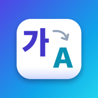
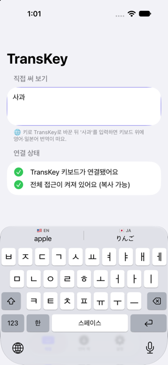
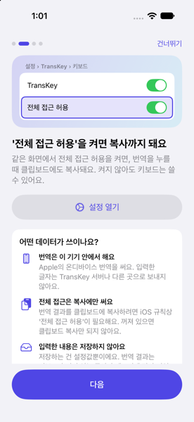
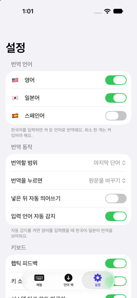
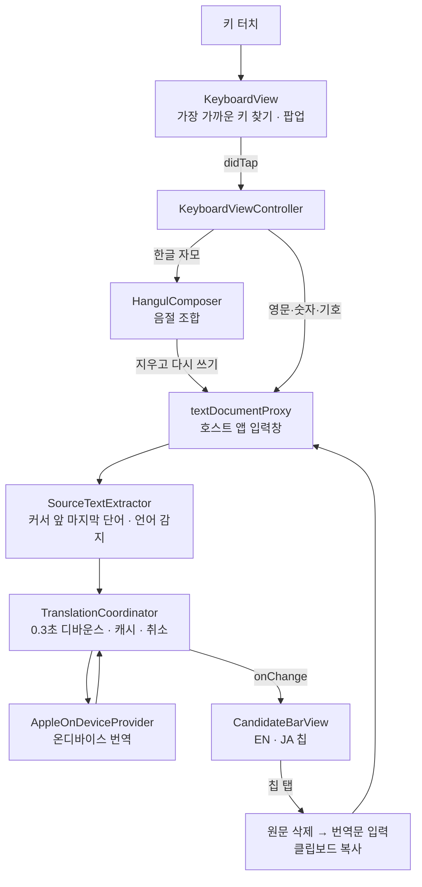
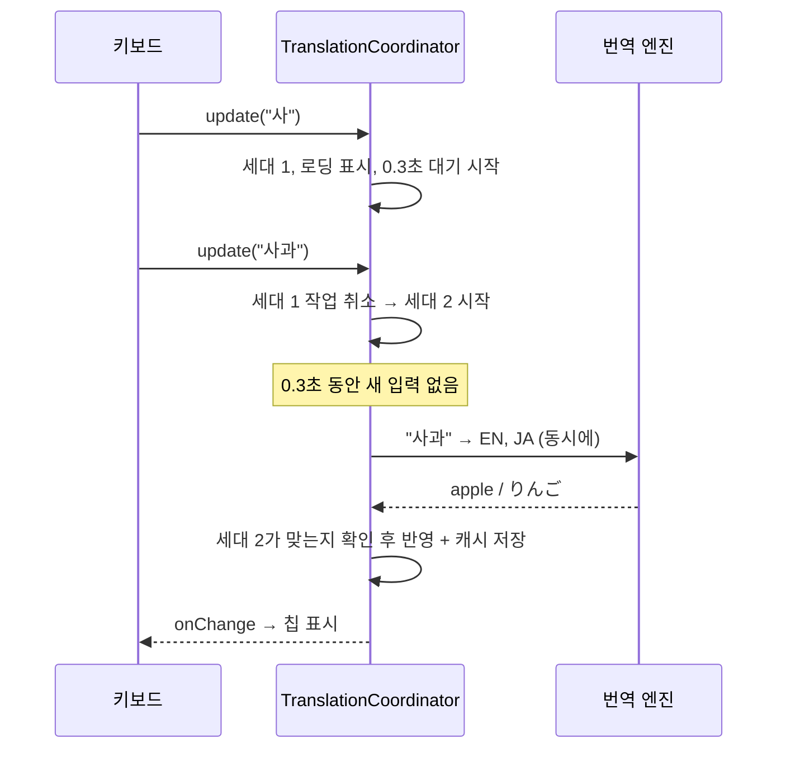
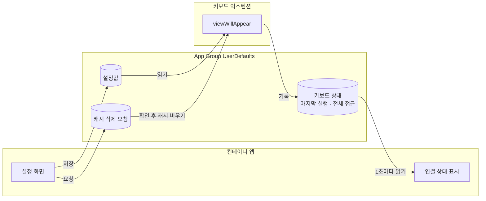

<p align="center">
  
</p>

<h1 align="center">TransKey</h1>

<p align="center">
  한국어로 입력하면 키보드 바로 위에 <b>영어·일본어 번역</b>이 뜨는 iPhone 키보드<br>
  탭 한 번으로 번역문이 입력되고 클립보드에도 복사돼요.
</p>

<p align="center">
  
  
  
</p>

---

## 주요 기능

- **실시간 번역 칩**: 카톡, 메모, 사파리 등 어떤 앱에서든 "사과"를 입력하면 키보드 위에 `🇺🇸 apple` `🇯🇵 りんご`가 떠요.
- **탭하면 바로 교체 + 복사**: 칩을 누르면 "사과"가 "apple"로 바뀌고, 전체 접근이 켜져 있으면 클립보드에도 복사돼요.
- **한글 두벌식 자판 직접 구현**: 겹받침(값, 닭), 이중모음(과, 의), 연음(읽어), 자모 단위 백스페이스를 처리해요.
- **기기 안에서 번역**: Apple 온디바이스 번역을 사용해 입력한 글자를 외부 서버로 보내지 않아요.
- **비밀번호 입력창에서는 자동으로 꺼짐**: 보안 입력창에서는 번역 바가 사라지고 아무것도 처리하지 않아요.
- **설정**: 번역 언어(영어·일본어·스페인어) 켜고 끄기, 단어/문장 단위, 교체/뒤에 붙이기, 햅틱, 키 소리, 다크 모드 등.

## 요구 사항

| 항목 | 버전 |
|---|---|
| iOS | 26.0 이상 |
| Xcode | 26 이상 (Xcode 27에서 개발) |
| Swift | 6 |
| 외부 라이브러리 | 없음 |

> iOS 26이 최소 버전인 이유: 키보드처럼 화면(SwiftUI)이 없는 곳에서 Apple 번역 세션을 만드는
> `TranslationSession(installedSource:target:)`가 iOS 26부터 제공되기 때문이에요.

---

## 전체 동작 흐름

키 하나를 눌렀을 때부터 번역 칩이 뜨고, 칩을 탭해 입력되기까지의 과정이에요.



### 1. 키 입력 → 화면에 글자 쓰기

키보드 익스텐션은 다른 앱의 입력창에 직접 접근할 수 없어요.
iOS가 주는 **`textDocumentProxy`**(입력창 대리 객체)를 통해서만 글자를 넣고(`insertText`) 지울 수 있어요(`deleteBackward`).

| 단계 | 코드 | 하는 일 |
|---|---|---|
| ① 터치 | [`KeyboardView`](Keyboard/Views/KeyboardView.swift) | 키 사이 빈틈을 눌러도 가장 가까운 키로 보내고, 확대 팝업을 띄워요. |
| ② 분배 | [`KeyboardViewController`](Keyboard/Controller/KeyboardViewController.swift) | 키 종류(문자, 스페이스, 삭제, Shift, 한/영…)에 따라 처리 함수로 보내요. |
| ③ 입력 | `insertCharacter` | 한글 자모면 조합기로, 영문·숫자면 바로 입력해요. |
| ④ 후처리 | `afterEdit` | 자동 대문자, 리턴 키 모양을 갱신하고 번역을 요청해요. |

### 2. 한글 조합 (두벌식 오토마타)

코드: [`HangulComposer.swift`](Packages/TransKeyCore/Sources/TransKeyCore/Hangul/HangulComposer.swift)

한글 음절은 **초성 + 중성 + 종성(받침)** 으로 이루어지고, 유니코드는 11,172개 음절을 순서대로 배치해 두었어요.
그래서 음절을 계산으로 만들 수 있어요.

```
음절 코드 = 0xAC00 + (초성 번호 × 21 + 중성 번호) × 28 + 종성 번호
예) "각" = 0xAC00 + (0[ㄱ] × 21 + 0[ㅏ]) × 28 + 1[ㄱ] = 0xAC01
```

서드파티 키보드는 밑줄로 표시되는 "조합 중 상태"를 앱마다 안정적으로 쓸 수 없어요.
그래서 **조합 중인 글자를 실제로 넣어 두고, 자모가 들어올 때마다 지우고 다시 쓰는** 방식을 써요.

| 입력 | 문서에서 일어나는 일 | 설명 |
|---|---|---|
| ㅅ | `ㅅ` 넣기 | 초성 |
| ㅏ | `ㅅ` 지우고 `사` 넣기 | 초성 + 중성 |
| ㄱ | `사` 지우고 `삭` 넣기 | 받침 |
| ㅗ | `삭` 지우고 `사고` 넣기 | **연음**: 받침 ㄱ이 다음 음절 초성으로 이동 |
| ㅏ | `고` 지우고 `과` 넣기 | **이중모음**: ㅗ + ㅏ = ㅘ |

백스페이스는 입력할 때마다 쌓아 둔 이전 상태를 하나씩 꺼내서 `닭 → 달 → 다 → ㄷ → (빈칸)` 처럼 자모 단위로 지워요.

### 3. 번역 파이프라인

코드: [`TranslationCoordinator.swift`](Packages/TransKeyCore/Sources/TransKeyCore/Translation/TranslationCoordinator.swift)

빠르게 타이핑해도 키 입력이 버벅이지 않고, 오래된 결과가 최신 결과를 덮어쓰지 않도록 설계했어요.



| 장치 | 목적 |
|---|---|
| **디바운스 0.3초** | 입력이 멈춘 뒤에만 번역해서 불필요한 요청을 줄여요. |
| **Task 취소** | 새 입력이 오면 이전 번역 작업을 취소해요. |
| **세대 번호** | 늦게 도착한 옛 응답은 버려요(레이스 컨디션 방지). |
| **LRU 캐시(200개)** | 같은 단어는 디바운스 없이 즉시 보여줘요. |
| **타임아웃 3초 + 재시도 1회** | 일시적인 실패를 자동으로 복구해요. |
| **엔진 추상화** | `TranslationProvider` 프로토콜로 온디바이스·클라우드·폴백 엔진을 갈아 끼울 수 있어요. |

### 4. 앱 ↔ 키보드 데이터 공유

컨테이너 앱과 키보드는 서로 다른 프로세스라서 **App Group**(공유 저장소)으로만 데이터를 주고받아요.



> 사용자가 입력한 텍스트는 공유 저장소에 **절대 저장하지 않아요.** 설정값과 키보드 상태만 주고받아요.

---

## 프로젝트 구조

```
TransKey/
├─ App/                         컨테이너 앱 (SwiftUI)
│  ├─ TransKeyApp.swift         앱 진입점
│  ├─ AppState.swift            전역 상태(설정 저장, 온보딩, 키보드 연결 상태)
│  ├─ RootView.swift            온보딩 ↔ 탭 화면 전환
│  ├─ Onboarding/               첫 실행 안내 4단계
│  ├─ Home/                     체험 탭(테스트 입력창, 연결 상태)
│  ├─ LanguagePacks/            번역 언어 팩 다운로드
│  ├─ Settings/                 설정 탭
│  └─ Shared/                   공용 뷰(상태 표시, 개인정보 안내, 입력창)
├─ Keyboard/                    키보드 익스텐션 (UIKit)
│  ├─ Controller/               KeyboardViewController(입력 처리의 중심), 햅틱·클릭음
│  ├─ Views/                    자판, 키 버튼, 팝업, 후보 바, 번역 칩
│  └─ Translation/              시뮬레이터 전용 데모 번역
├─ Packages/TransKeyCore/       앱과 키보드가 함께 쓰는 로직 (UIKit 의존 없음)
│  ├─ Hangul/                   두벌식 한글 조합기
│  ├─ Keyboard/                 자판 배열, 키 위치 계산, Shift, 자동 대문자
│  ├─ TextProcessing/           번역할 원문 추출, 언어 감지
│  ├─ Translation/              번역 엔진 프로토콜, Apple 번역, 코디네이터, 캐시
│  ├─ Settings/                 설정 모델과 저장소
│  └─ Shared/                   언어 정의, App Group, 앱↔키보드 공유 상태
├─ Config/                      키보드 Info.plist, 엔타이틀먼트
├─ Tools/GenerateAppIcon.swift  앱 아이콘 생성 스크립트
└─ docs/images/                 README 스크린샷
```

**설계 원칙**

- **MVVM + 프로토콜 기반 의존성 주입**: `SettingsStoring`, `TranslationProvider` 등을 주입받아 테스트에서 가짜 구현으로 바꿔요.
- **로직은 패키지로 분리**: 한글 조합, 번역 파이프라인, 레이아웃 계산은 UIKit 없이 동작해서 macOS에서 `swift test`로 빠르게 검증해요.
- **키보드는 가볍게**: 키보드 익스텐션은 메모리 제한이 엄격해서(약 50~70MB) 외부 라이브러리와 무거운 리소스를 쓰지 않아요.

---

## 실행 방법

### 시뮬레이터

1. `TransKey.xcodeproj`를 Xcode로 열어요.
2. 상단 스킴을 **TransKey**, 기기를 iPhone 시뮬레이터로 고르고 **⌘R**.
3. 시뮬레이터에서 **설정 › 일반 › 키보드 › 키보드 › 새로운 키보드 추가 › TransKey**를 켜요.
4. 앱의 "체험" 탭 입력창을 누르고 🌐 키로 TransKey로 바꿔요.

> ⚠️ **시뮬레이터에서는 Apple 온디바이스 번역이 동작하지 않아요.**
> 화면 확인용으로 단어 15개짜리 데모 사전(사과, 안녕하세요, 감사합니다, 고양이 …)으로 대신 번역해요.
> 모든 단어 번역은 실기기에서 언어 팩을 받은 뒤에 돼요.
>
> 화면 키보드가 안 올라오면 시뮬레이터 창에서 **⌘K**(I/O › Keyboard › Toggle Software Keyboard)를 눌러 주세요.

### 실기기

1. 아이폰을 USB로 연결하고, 아이폰에서 **설정 › 개인정보 보호 및 보안 › 개발자 모드**를 켜요.
2. Xcode에서 **TransKey**, **TransKeyKeyboard** 두 타깃의 **Signing & Capabilities**에서
   - Team을 본인 계정으로 선택
   - Bundle Identifier의 `com.example`을 본인만의 이름으로 변경
   - App Group 이름도 같이 변경(`Config/*.entitlements`, `AppGroup.swift`)
3. 기기를 아이폰으로 고르고 **⌘R**.
4. TransKey 앱의 **언어 팩** 화면에서 한국어→영어, 한국어→일본어를 받아요.

### 테스트

스킴을 **TransKeyCore**로 바꾸고 **⌘U**, 또는 터미널에서:

```bash
cd Packages/TransKeyCore && swift test
```

117개 테스트: 한글 조합 51개, 번역 코디네이터(디바운스·레이스 컨디션·캐시·재시도·타임아웃), 원문 추출, 자판 레이아웃, 설정 저장 등.

---

## 알려진 제한

| 항목 | 내용 |
|---|---|
| 시뮬레이터 번역 | Apple 번역이 시뮬레이터를 지원하지 않아 데모 사전만 동작해요. |
| 키보드 안에서의 Apple 번역 | 문서상 금지되지는 않았지만 공식 보장도 없어요. 실기기 검증이 필요해요. |
| 전체 접근이 꺼져 있을 때 | 클립보드 복사와 햅틱이 동작하지 않아요(iOS 규칙). |
| 무료 개발자 계정 | App Group을 지원하지 않을 수 있어, 앱 설정이 키보드에 반영되지 않을 수 있어요. |
| 영어 UI | 아직 한국어만 지원해요. |

## 개인정보

- 번역은 Apple 온디바이스 번역으로 **기기 안에서** 처리해요. 입력한 글자를 외부 서버로 보내지 않아요.
- 저장하는 것은 **설정값뿐**이에요. 최근 번역 결과는 키보드가 켜져 있는 동안 메모리에만 잠깐 보관해요.
- 비밀번호 입력창에서는 번역 기능이 완전히 꺼져요.
- 로그에 사용자가 입력한 원문을 남기지 않아요.
